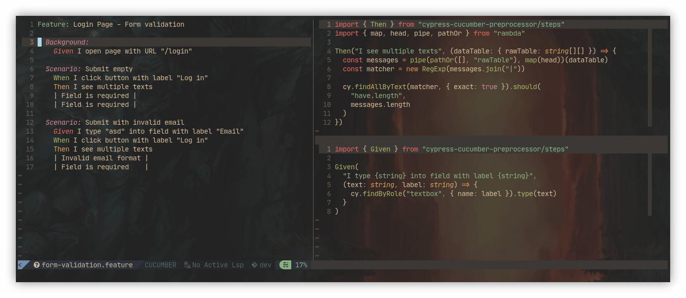

# E2E testing

> The more your tests resemble the way your software is used, the more
> confidence they can give you.  
> [:bird: Kent C. Dodds][intro_kentcdodds-quote]



[intro_kentcdodds-quote]:
  https://twitter.com/kentcdodds/status/977018512689455106

## Table of contents

<!-- vim-markdown-toc GFM -->

- [Stack](#stack)
- [Folder structure](#folder-structure)
- [Environment variables](#environment-variables)
  - [Local](#local)
- [Scripts](#scripts)

<!-- vim-markdown-toc -->

## Stack

- [Cypress][stack_cypress] - Fast, easy and reliable testing for anything that
  runs in a browser.
- [Cucumber][stack_cucumber] - Add support for [Cucumber Gherkin
  syntax][stack_gherkin-syntax] when writing Cypress tests.
- [Cypress Testing Library][stack_cypress-testing-library] - Cypress Testing
  Library allows the use of dom-testing queries within Cypress end-to-end
  browser tests.

[stack_cypress]: https://www.cypress.io
[stack_cucumber]:
  https://github.com/TheBrainFamily/cypress-cucumber-preprocessor
[stack_gherkin-syntax]: https://cucumber.io/docs/gherkin/reference
[stack_cypress-testing-library]:
  https://testing-library.com/docs/cypress-testing-library/intro

## Folder structure

- [`core.steps`](src/core.steps) - Cucumber global steps/primitives definitions
- [`page.*`](src) - Folders with tests split by page (mirror same structure as
  in [`@oauth-ui/react`](../@oauth-ui.react/src/)

## Environment variables

- `CYPRESS_BASE_URL` - URL used as prefix for `cy.visit()` or `cy.request()`
  command's URL

### Local

Copy and rename `.env.template` to `.env`. Variables get picked up by
[`cypress-dotenv`][local_cypress-dotenv].

[local_cypress-dotenv]: https://github.com/morficus/cypress-dotenv

## Scripts

- Before running any script, make sure to configure `CYPRESS_BASE_URL`
- Run `npm` commands from the monorepo root folder

**Start interactive debug session:**

```bash
# "start": "cypress open"
npm run start
```

**Run tests once:**

```bash
# "test": "cypress run --headed --config video=false,screenshotOnRunFailure=false",
npm run test
```

**Run tests once with reporter configs (meant to run in CI):**

```bash
# "test.ci": "cypress run --reporter junit --reporter-options mochaFile=test_reports/e2e/result-[hash].xml,toConsole=true"
npm run test.ci
```
